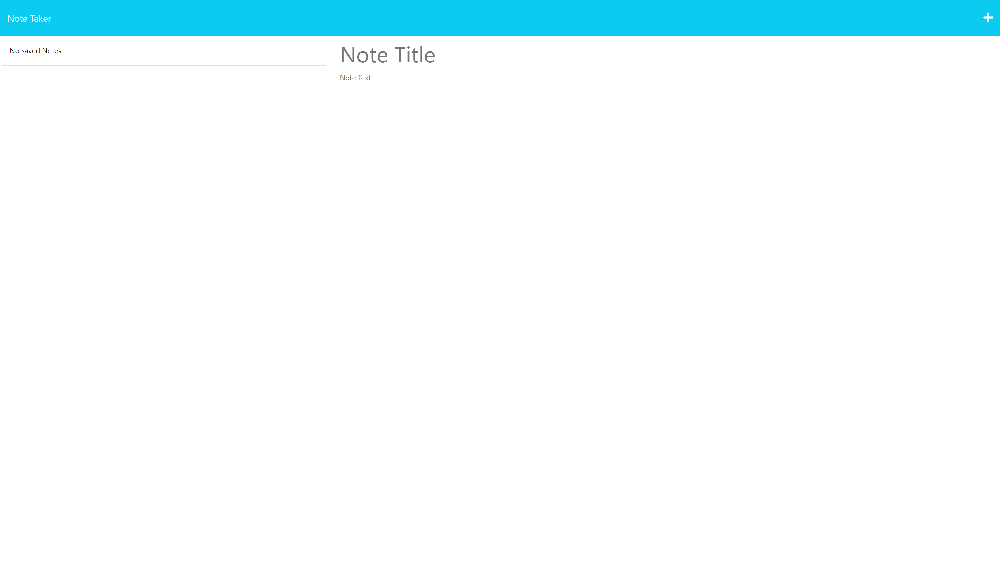

# Note Taker

## Description

This note taker application uses both front end and backend technologies to keep track of entered notes and their respective descriptions. It uses GET, POST, and DELETE requests using express.js to acheive the functionality that they provide.

## Installation

The following packages are required to run this application:
- Express
- path
- uuid  

Using ```npm i``` will download all of these modules.

## Usage

To create a note, enter the title and the description of your note where the words "Note Title" and "Note Text" are located. Then, click the save icon. This should create a list on the left column of the page. Clicking the "+" icon will clear the text field and allow you to enter a new one. Clicking the trash can icons next to one of the notes in the left column will delete that note. Clicking on the body of one of the previously entered notes will bring up that note and description in the right column.

 